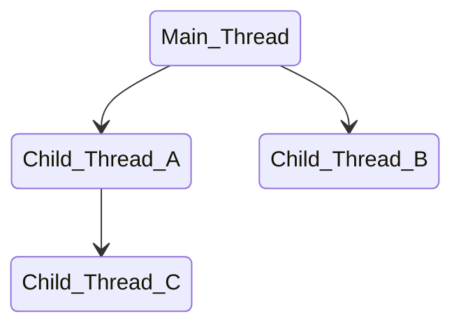

# Parallel computing architectures
## Flynn's Taxonomy

| Instruction vs Data Streams | Description               | 
| --------------------------- | ------------------------- |
|  **SISD**                   | Sequential Computer with single processing unit |
|  **SIMD**                   | Multi processor parallel computer. They execute the same instruction on different data element (for ex. GPUs)|
|  **MISD**                   | Each CPU executes their own separate instruction on the same data |
|  **MIMD**                   | Every CPU executes their own instruction on different data |

# Parallel Programming Model
- Single Program, Multiple Data (SPMD)
    - Every CPU executes the same program on multiple data (most common)
- Multiple Program, Multiple Data (MPMD)
    - Every CPU executes different program. One processing node is the host/manager, which farms out data to the other nodes, which execute other programs, and return the processed data to the host/manager (functional decomposition)

# Shared VS Distributed Memory

Memory Speed < Processor Speed

## Shared Memory
- All processors access the same memory with global address space
- Architectures:
    - Uniform memory access (UMA): All processors have equal access to the memory (equally fast)
        - Symmetric Multiprocessing (SMP): Multiple CPUs connected to the same shared memory through a **system bus**
        - Lookup: cache coherency
    - Non-uniform memory access (NUMA): Connecting multiple SMP systems together via system bus
        - don't scale well
        - synchronization of shared memory access is up to the programmer

## Distributed Memory
- Each processor has it's own local memory with it's own address space.
- Concept of global address space doesn't exist
- All processors are connected through a network (for ex. ethernet)
- Change in the processor's local memory is not reflected to the others
- Data communication between processors is up to the programmer
- this architecture is scalable

| Process | Thread |
| ------- | ------ |
| Includes code, data, and state information  Independent instance of a running program  Separate address space | Independent path of execution  Subset of a process  Operating system schedules threads for execution |

> NOTE: Threads that belong to the same process share the process's address space, which gives them access to the same resources and memory, including the programs's executable code and data. Sharing data between processes is not that trivial.

# Inter-Process Communication (IPC)
- Sockets and pipes
- Shared memory
- Remote procedure calls

# Threads vs Processes
- Are "lightweight - require less overhead to create and terminate
- Operating systems can switch between threads faster than processes

# Concurrency vs parallel execution

> **Concurrency**: Ability of a program to be broken into  parts that
can run independently of each other

## Example:
Salad recipe:
1. Chop lettuce.
2. Chop cucumbers.
3. Chop tomatoes.
4. Chop onions.
5. Mix vegetables.
6. Add dressing.

Tasks 1-4 are concurrent, since the order of their execution is independent from each other.

> **Concurrent execution**: Concurrent tasks using a single processor. 
In this case the tasks are using the resource concurently and 
the time of execution is the sum of performing each task individually. 
It is not true parallel execution. Useful for I/O dependent tasks, for ex. device drivers.

> **Parallel Hardware**: Multi-Core processors, Graphics Processing Units, Computer Cluster

> **Parallel execution**: Execute tasks in parallel on different processors. Useful for ex. large math
operations, which can be divided into independent sub-parts.

# Execution scheduling
> **Scheduler**: Operating system function that assigns processes
and threads to run on available CPUs

> **Context Switch**:
> - Storing the state of a process or thread to resume later
> - Loading the saved state for the new process or thread to run

> **Scheduling Algorithms**:
> - First come, first  served
> - Shortest job next
> - Priority
> - Shortest remaining time
> - Round-robin
> - Multiple-level queues

> **Scheduling Goals**:
> - Maximize throughput
> - Maximize fairness
> - Minimize wait time
> - Minimize latency

